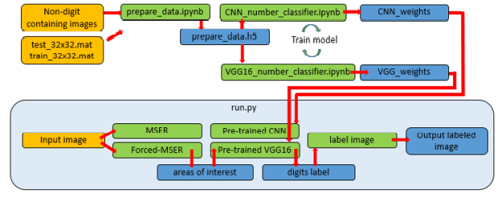
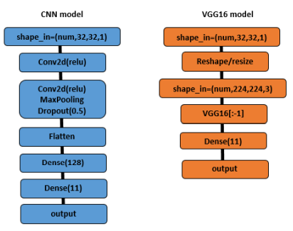
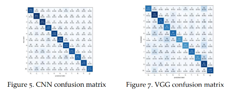
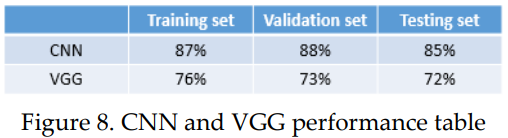
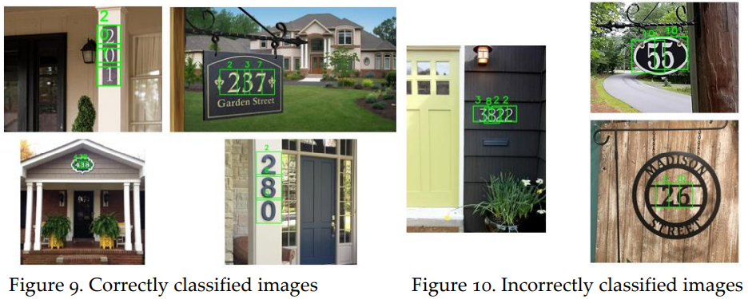

# House Address Classifier

## Introduction

In this project, an algorithm, along with two distinct classifiers, a CNN trainable classifier and a VGG16 pre-trained classifier, were designed to correctly identify house addresses within images.

## My Implementation
A diagram of the method used to correctly identify and classify the house addresses can be seen below. The figure shows that the method consists of a training phase for both classifiers. The saved weights from the training phase are used in a run file that takes the input images, locates the digit containing areas, and classifies those areas. Finally, the predicted values from the classifier are used to label the input images and then the labeled images are saved.

  

The CNN model was designed to classify the input area as 1 of the 11 classes. The 11 classes were a digit 0 through 9 or non-digit. The CNN model was trained on the data produced by the "prepare_data" file and was built using tensorflow sequential. The CNN model is fairly simple and is diagramed below. As shown, the model consists of a convolution layer, a convolution, pooling layer, and dropout layer to prevent overfitting, and two dense layers. This model was simple but surprisingly effective. 

The VGG model was a modified version of the "Imagenet" VGG16 model. The modification was a removal of the last "Dense" layer, which classified images into 1/4000 
categories, and replacing it with a new "Dense" layer that classified images in 1/11 categories. Again, those categories were a digit 0-9 or not a number. A model of the modified VGG model can be seen below.

 

To run results (NOTE: CNN and VGG trained weights are not included here and are needed to run "run.py"):
Before running:
1. install all needed packages
2. Folders: To run this script, a folder "graded_images" must be created in the working directory.
3. Download "CNN_weights.data-00000-of-00001", "CNN_weights.index", "VGG_weights.data-00000-of-00001" and "VGG_weights.index"

How to run:
1. make sure all of the following files are placed in the same directory: (All images to be tested, "CNN_weights.data-00000-of-00001" and "CNN_weights.index","VGG_weights.data-00000-of-00001" and "VGG_weights.index", run.py
2. open the run.py file and select the classifier to use. (comment out line 275 to test the CNN classifier, un-comment out line 275 to test the VGG classifier)
3. save, close, and run the run.py file

## Results
Overall, the system worked very well. The CNN classifier was able to correctly classify digits at different scales and orientations, locations within the image, lightings, and background colors. The results of successful classifications can be seen in "Figure 9".

Though, overall the CNN classifier worked well, it was not perfect. The classifier did have an issue with oddly bordered addresses. Incorrectly classified images can be seen in "Figure 10".

 
 
 